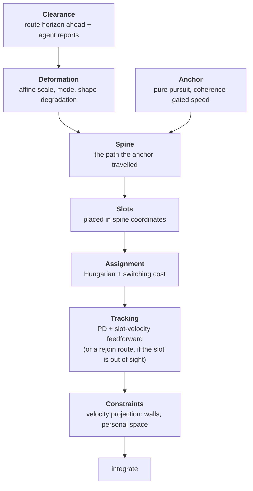
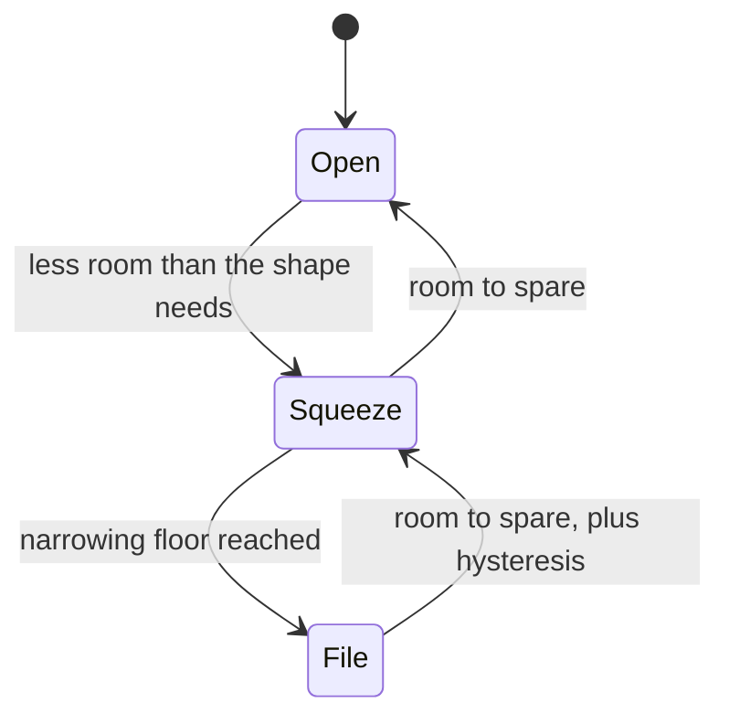

# Deformable Virtual Structure

The steering pattern this simulation uses: agents hold a formation, and the formation itself
squeezes and spreads to fit the space the group is moving through.

This document is both the design and the record of building it — including the parts that were
tried and thrown away, which are usually the most useful thing to write down.

---

## 1. Why the flocking model had to go

The simulation used to steer agents by summing weighted behaviours: separation, cohesion,
alignment, formation-slot attraction, obstacle avoidance. It could not hold a formation at any
weight setting, for three structural reasons.

### Fault 1 — radius inversion

Separation radius was `1.5`. Slot spacing was `1.2`.

The slot lattice sat *inside* the repulsion field, so an agent standing perfectly in its slot was
still being shoved by every neighbour. The two systems had no shared equilibrium — one of them
had to lose, continuously. Measured on an open map with five agents in a wedge:

| Quantity | Old model | Nominal |
| --- | --- | --- |
| Mean distance from assigned slot | **1.46** | 0 |
| Mean nearest-neighbour gap | **0.95** | 1.20 |
| Mean weighted separation force | **4.55** | — |
| Mean weighted formation-slot force | **2.98** | — |

Agents sat further from their slots than the slots were from each other. There was no formation
being held; there was a flock with a mild bias.

### Fault 2 — fusion by summation discards the structure of the problem

Summing competing objectives guarantees none of them. Directly opposed terms cancel into a
spurious equilibrium — the agent stops in a doorway with two large forces in balance. Worse, the
summed behaviours were not the same *kind* of thing:

- *Hold your slot* is a preference, and it is negotiable.
- *Do not overlap another agent* is a constraint, and it is not.
- *Do not walk into a wall* is also a constraint.

A weighted sum cannot express "never violate this, and otherwise do as much of that as
possible". That distinction has to live in the architecture.

### Fault 3 — static slot binding

Slot *i* belonged to agent *i*, forever. When the squad turned, world-space slots swapped sides
and agents crossed the formation to reach them.

### What it added up to

A wedge of five at 1.2 spacing is 3.6 wide. A corridor is one tile. The old model had exactly one
way to fit the first through the second: destroy the formation. That is what it did — along with
dragging stragglers through thin walls, and deadlocking whenever a formation was deeper than the
waypoint gate's arrival radius.

---

## 2. The pattern

> **The formation is a deformable virtual structure.** The group senses its environment and
> deforms one shared shape to fit it; agents track slots in that shape; collision avoidance is a
> constraint on tracking, never a competing preference.

Six layers, each with one responsibility and a strict data flow. The layering is what stops
behaviours from fighting: a lower layer's output is an *input* to the next, not a term to be
summed with it.



| Module | Responsibility |
| --- | --- |
| `shape.js` | Nominal lattices and what each may degrade into |
| `clearance.js` | Free width ahead, agent reports, and route centring |
| `deformation.js` | Affine state, safety floor, rate limits, mode machine |
| `spine.js` | The anchor's trail, and sampling positions along it |
| `assignment.js` | Which agent holds which slot |
| `tracking.js` | One agent's desired velocity |
| `rejoin.js` | Routing back when the slot is behind a wall |
| `constraints.js` | Nearest feasible velocity to the desired one |
| `controller.js` | The tick pipeline that drives all of the above |

---

## 3. Deformation

The formation carries an affine transform applied to its nominal lattice:

```
    slot(i) = spine(−offsetᵢ.y · sy · spacing) + across · (offsetᵢ.x · sx · spacing)
```

### Narrowing lengthens: area preservation

```
sy = clamp(1 / sx, 1, maxLongitudinalScale)
```

A formation that narrows has to put its agents somewhere, so it gets longer. A wedge entering a
corridor stretches toward a file *continuously* — one transform, not a special case per shape.

```
 open (sx = 1.0)          squeezing (sx = 0.5)     file (degraded shape)

        ●                        ●                          ●
      ●   ●                    ●  ●                          ●
    ●       ●                 ●    ●                         ●
                              ●    ●                          ●
   3.6 wide                  1.8 wide                        ●
   2.4 deep                  4.8 deep                     0.0 wide
```

### The narrowing floor is derived, not declared

The floor is the tightest lateral scale at which no two slots come closer than personal space —
found by searching the deformed lattice, not by a number written next to each shape:

```js
for (let scale = 1; scale > 0; scale -= 0.01) {
  if (minimumSlotGap(offsets, scale) < personalSpace) break;
  floor = scale;
}
```

This matters because **body radius is the primary constant**. Personal space is `2 · bodyRadius`
plus a sliver; the floor follows from it; corridor margins and wall clearance follow from it too.
Change the size of an agent and every limit moves consistently — no shape can declare itself into
a lattice its agents do not physically fit in.

### Where the target comes from

Two readings, combined by taking the tighter:

**Feedforward — the route probe.** Sample the anchor plus the next few waypoints; at each, cast
rays across the route and take `min(left, right)`. Because it looks ahead, the formation is
*already narrow when it arrives* at a doorway rather than discovering the wall on contact. This is
the single biggest behavioural difference from the old model.

**Feedback — agent reports.** Each agent in formation reports the room it has. This catches what
a centreline probe misses, and it keeps the squad narrow while its *tail* is still in a corridor
the head has already left.

Agent reports are corrected for the agent's own lateral offset from the spine:

```
halfWidth = min(offset + right, left − offset)
```

That correction is essential, and getting it wrong cost an afternoon. Reading room straight off
an agent's position makes the formation measure *its own width*: an agent that spreads out to the
right sees less room to its right, the group squeezes, the agent comes back in, the reading
widens, the group spreads — and the shape pumps between wedge and file forever. Adding the offset
back cancels exactly that term.

### Rate limits, hysteresis, asymmetry

- **Rate limited**, so slots move slowly enough to be tracked rather than teleporting.
- **Asymmetric**: contract at 2.5/s, expand at 0.7/s. Narrowing early is cheap; widening early
  puts an agent into a wall.
- **Smoothed demand**: clearance readings jitter as the anchor crosses tiles, so the group acts on
  a low-passed belief about its room, not a single reading.
- **Hysteresis on mode**, or a squad hovering at a doorway flickers between shapes every tick.



`File` is a *topology* change — the shape swaps to what it degrades into — where `Squeeze` is a
*geometry* change. Keeping them distinct means the continuous controller never has to
discontinuously reorder slots; that happens only on the mode edge, where the assignment layer
absorbs it.

---

## 4. The spine

Slots are not placed in a rigid frame around the anchor. They are placed **along the path the
anchor actually travelled**:

```
longitudinal offset → arc length back along the trail
lateral offset      → across the trail's tangent at that point
```

On straight ground this is identical to rigid placement. In a corridor it is the difference
between working and not working: a rigid file reaches its trailing slots *straight back along the
heading*, which puts them inside the wall the moment the route turns — and a slot inside a wall is
a slot no agent can hold. The squad then stalls, waiting for coherence that can never arrive.

On the spine, every slot sits in space the anchor has already proved to be free, and a file bends
around corners the way a queue of people does.

Two details make it safe:

- Sampling further back than the recorded trail **extrapolates only as far as free space allows**,
  so a squad that has not moved yet — spawned with its back to a wall — does not hang its slots
  outside the map.
- A slot whose lateral offset is blocked is **pulled in along that offset** until it is reachable,
  rather than collapsed onto the anchor. Collapsing stacks the whole squad on one point, which no
  personal space allows and no formation can hold.

---

## 5. Progression

The old gate — "advance the waypoint when the farthest agent is within the arrival radius" —
coupled progress to the worst tracking error, which is why any formation deeper than 2.5 units
deadlocked. It is replaced by three pieces:

**Coherence.** `C = 1 − mean(‖pᵢ − slotᵢ‖) / maxSlotError`, clamped to `[0, 1]`.

**A gated anchor.** `v = anchorSpeed · (minimumGate + (1 − minimumGate) · smoothstep(C))`. The
formation slows for its own stragglers instead of dragging them with an attraction force.

The `minimumGate` floor is not a detail: **the gate slows the squad, it never stops it.** A squad
that cannot form up — boxed in, split by geometry, one agent stuck — must still creep forward,
because moving is usually what resolves the situation. Without the floor, "wait for your
stragglers" and "the straggler can only rejoin if the squad moves" deadlock against each other.

**Closest-point waypoint progression.** A capture radius alone is not enough once the anchor
steers at a look-ahead point: it cuts corners, sweeps past a waypoint outside the radius, and
leaves it in the list forever, dragging the carrot backwards behind the squad. Advancing while the
*next* waypoint is closer than the current one cannot be outrun.

The look-ahead point itself is line-of-sight gated — the carrot stops at the last waypoint in
clear view — which keeps corner-cutting from crossing walls.

---

## 6. Assignment

Slots are assigned each tick by minimising total squared distance (Hungarian, O(n³), trivial at
squad sizes), with a switching cost added to any pairing that differs from last tick's:

```
cost(i, s) = ‖pᵢ − slots‖² + (previous(i) === s ? 0 : λ)
```

Without λ, two agents equidistant from two slots trade places every tick and neither arrives. With
it, reassignment happens only when it is clearly worth it — which is exactly at a mode change, or
when an agent has genuinely fallen to the back. In the chokepoint fixtures this took reassignments
over a full run from **1905 to 9**.

---

## 7. Tracking, rejoining, and constraints

**Tracking** is one term: `v = slotVelocity + gain · (slot − position)`. The feedforward matters
more than the gain — slots move because the anchor moves and because the shape deforms, and an
agent chasing where its slot *was* trails it permanently.

**Rejoining** handles the one case tracking cannot: an agent whose slot is behind a wall. A
straight-line pull presses it into that wall forever. Such an agent plans an A* route to its slot
and follows it until it can see the slot again. This is the only place an individual agent plans
for itself, and it is what makes the coherence gate safe to rely on.

**Constraints** filter the result. Each is a half-plane — an outward normal and the fastest the
agent may still approach along it — and violations are removed by projection:

```js
const approach = -dot(velocity, normal);
if (approach > maxApproach) {
  velocity = add(velocity, scale(normal, approach - maxApproach));
}
```

Walls permit exactly the approach that closes the remaining gap in one tick, so an agent may skim
a wall but never enter it. Personal space is reciprocal: each agent gives up half the closing
speed, so a pair stays symmetric without either knowing the other's intent.

The difference from a repulsion force is categorical: **a force can be outvoted by a larger force;
a projection cannot be outvoted at all.** Wall penetration stops being a question of which weight
is bigger. It also preserves what the constraint permits — sliding *along* a wall toward a doorway
is untouched, which is precisely the motion a doorway approach needs.

---

## 8. The invariant that makes the layers stop fighting

Personal space is chosen below the tightest slot gap the deformation can produce — which is
guaranteed by construction, since the floor is derived from personal space in the first place.

> When every agent is in its slot, **every constraint is inactive**. The constraint layer is silent
> inside a valid formation and wakes only on transient overlap.

Separation cannot fight the formation, because a correctly formed formation never triggers it.
Compare the old model, where separation was *always* active because the lattice sat inside its
radius. The fix is a structural guarantee, not a weight — and it is enforced by a test that sweeps
every shape, every body size, and every scale down to the floor.

---

## 9. Where the flocking behaviours went

| Behaviour | Fate |
| --- | --- |
| Separation | A hard constraint at personal space, active only on overlap |
| Cohesion | Subsumed — a formation *is* cohesion, expressed as geometry rather than force |
| Alignment | Subsumed — agents tracking slots on a shared spine are aligned by construction |
| Formation slot | Promoted to the primary objective, with velocity feedforward |
| Path attraction | Moved up a layer: the anchor follows the route, agents follow slots |
| Obstacle avoidance | Split — anticipation feeds deformation, reaction became a constraint |
| Centroid push | Deleted; it existed to counteract clumping that no longer happens |

A free flock is the same controller with an unpinned lattice: formation and flock are two ends of
one axis, not two systems fighting over one integrator.

---

## 10. Things that were tried and rejected

Recorded because each looked obviously right and was not.

**Hard wall collision on the old model.** Clamping positions out of blocked tiles stopped the
clipping and converted it into agents stuck against walls — every fixture failed instead of
passing. Collision response without per-agent routing just relocates the failure.

**Breadcrumb targets.** Letting a cut-off agent steer at the last waypoint it could see was
cheaper than routing, and it thrashed: the breadcrumb goes stale, the agent oscillates between it
and the live target. Rejoin routes replaced it.

**Anchor recentring.** Sliding the anchor toward the middle of the free span, live, each tick.
The anchor drifts sideways, which changes the heading, which changes the lateral axis, which
changes the drift — a limit cycle that flipped the squad's heading backwards at doorways.
Centring the *route*, once, at plan time, achieves the same thing without a feedback loop.

**Centring the whole route.** Centring every waypoint, including in open rooms, made routes wander
around large spaces and cost fixture A its arrival entirely. Centring now applies only where the
span is genuinely tight — open ground has no centre worth finding.

**Absolute agent clearance.** Described in §3: the formation measures its own width and pumps.

---

## 11. Prior art

- **Reynolds (1987), *Flocks, Herds, and Schools*** — the separation/alignment/cohesion triple this
  pattern retires. Reynolds (1999), *Steering Behaviors for Autonomous Characters*, adds arrival
  and path following.
- **Lewis & Tan (1997), *High Precision Formation Control of Mobile Robots Using Virtual
  Structures*** — treat the formation as one body and derive slots from its pose. This is that,
  made deformable.
- **Balch & Arkin (1998), *Behavior-Based Formation Control for Multirobot Teams*** — the
  behaviour-fusion formulation, and a good account of where weighted fusion runs out of road.
- **Zhao (2018), *Affine Formation Maneuver Control of Multi-Agent Systems*** — formations that
  translate, rotate, scale and shear a nominal configuration; the formal basis for §3.
- **Kamphuis & Overmars (2004), *Finding Paths for Coherent Groups Using Clearance*** — the closest
  match to this problem: groups on a backbone path, squeezing to fit available clearance.
- **Olfati-Saber (2006), *Flocking for Multi-Agent Dynamic Systems*** — α/β/γ agents, obstacles
  handled by projecting virtual agents onto their surfaces.
- **van den Berg et al. (2011), *Reciprocal n-Body Collision Avoidance* (ORCA)** — velocity-space
  half-plane constraints; §7's projection is a simplified form, including the reciprocal split.
- **Quinlan & Khatib (1993), *Elastic Bands*** — deformable paths under obstacle pressure.
- **Khatib (1986)** — the canonical statement of the local-minima and force-cancellation problems
  behind §1's second fault.

Considered and not chosen: **continuum crowds** (Treuille et al., 2006) replaces per-agent steering
with flow fields — excellent for hundreds of agents, wrong shape for squads of five that must hold
a named geometry.

---

## 12. Measured results

Five agents, default parameters, `dt = 0.1`. "Wall entries" counts agent-ticks spent inside a
blocked tile.

| Fixture | Ticks | Mean slot error | Closest approach | Wall entries | Reassignments |
| --- | --- | --- | --- | --- | --- |
| A — single chokepoint | 84 | 0.37 | 0.53 | 0 | 9 |
| B — two chokepoints | 77 | 0.31 | 0.55 | 0 | 6 |
| C — 1-tile corridor | 153 | 0.41 | 0.70 | 0 | 5 |
| C — 3-tile corridor | 154 | 0.45 | 0.55 | 0 | 7 |
| D — widening corridor | 201 | 0.44 | 0.69 | 0 | 6 |
| E — L-shaped corner | 168 | 0.48 | 0.58 | 0 | 5 |

Against the old model on the chokepoint fixtures: mean slot error **1.46 → ~0.35**, wall entries
**59 and 157 → 0**, reassignments over a run **1905 → 9**. Bodies never overlap in any fixture
(closest approach stays above `2 · bodyRadius = 0.5`).

Fixture D is the clearest picture of the pattern working. As the corridor steps 1 → 3 → 5 tiles:

```
segment    mode        formation width
1 tile     File        0.0
3 tiles    Squeeze     2.3
5 tiles    Open        3.6
```

Monotonic, stable, and no pumping between shapes.

---

## 13. Open questions

1. **Squad size versus corridor length.** A file of five spans six tiles. In a map whose corridors
   are shorter than that, the squad is nearly always in file. That is correct behaviour, but it
   suggests formation size should be chosen against the world's typical corridor length.
2. **Shear is unused.** The affine state carries scale only. Shear would let a formation lean into
   a turn rather than bending along the spine; the spine may already be the better answer, but it
   is untested.
3. **One squad.** Nothing here handles two formations meeting head-on in a corridor. Personal
   space keeps them from overlapping, but neither will give way, and the coherence gate will slow
   both. Squad-versus-squad yielding is a layer this design does not have.
