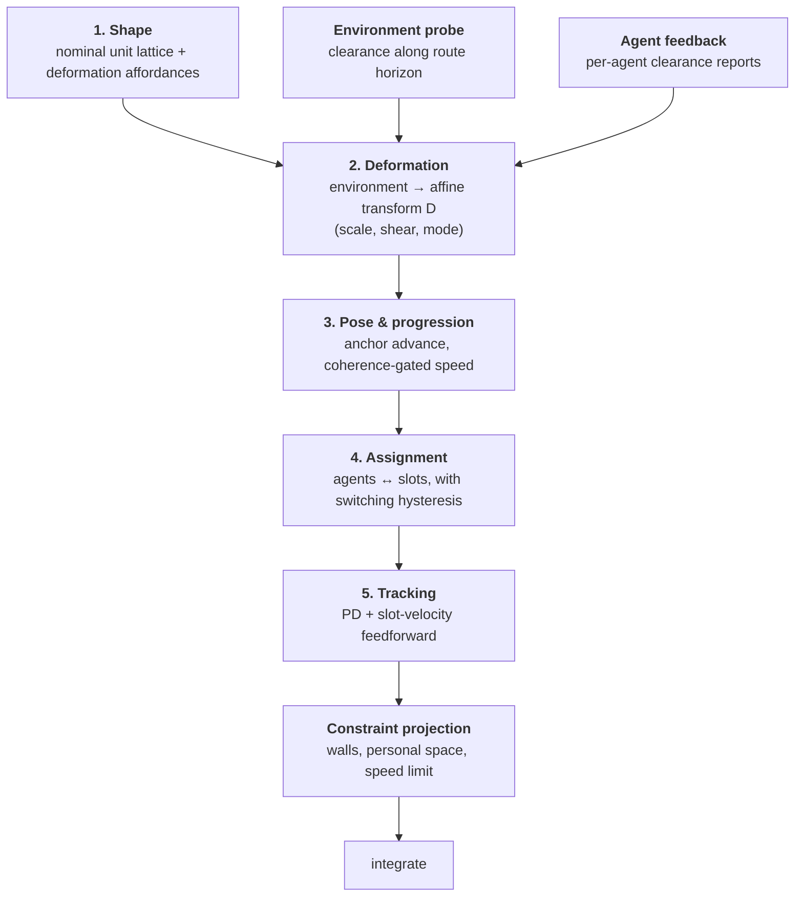
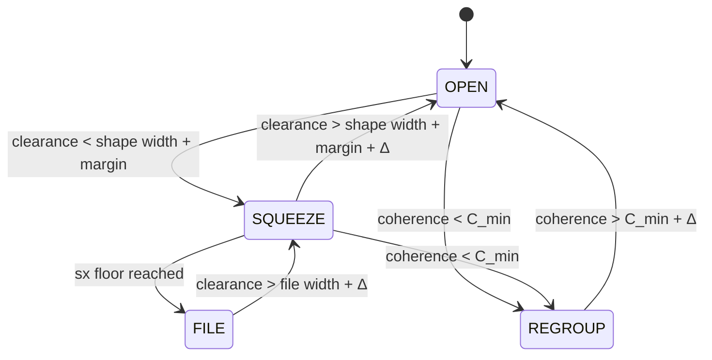

# Deformable Virtual Structure

A steering pattern for agents that want to hold a formation, where the formation itself
squeezes and spreads to fit the space the group is moving through.

This is a design document. Nothing here is implemented yet; the current simulation still uses
the weighted-sum boid model described in `README.md`.

---

## 1. What is actually wrong

The problem is not tuning. Three structural faults make the current model unable to hold a
formation at *any* weight setting.

### Fault 1 — radius inversion

`SeparationRadius` is `1.5`. `DEFAULT_FORMATION_SPACING` is `1.2`.

The slot lattice is *inside* the repulsion field. An agent sitting perfectly in its slot is
still within every neighbour's separation radius, so the formation's own geometry is a
permanent violation of the separation behaviour. The two systems have no shared equilibrium —
one of them must lose, continuously.

Measured on an open map, five agents, wedge at default spacing, sampled over a march:

| Quantity | Measured | Nominal |
| --- | --- | --- |
| Mean distance from assigned slot | **1.46** | 0 |
| Mean nearest-neighbour gap | **0.95** | 1.20 |
| Mean weighted separation force | **4.55** | — |
| Mean weighted formation-slot force | **2.98** | — |

Agents sit further from their slots than the slots are from each other. There is no formation
being held; there is a boid flock with a mild bias.

Lowering the spacing makes it worse, not better — at `0.6` spacing (what the demo needs to
avoid the arrival-gate stall) separation still wins 4.68 to 2.39.

### Fault 2 — fusion by summation discards the structure of the problem

`composeSteering` adds weighted behaviour vectors and truncates the result. Superposition is
the standard critique of potential-field control: summing competing objectives gives no
guarantee that *any* of them is satisfied, and directly opposed terms cancel to a spurious
equilibrium — the agent stops in a doorway with two large forces in balance.

The behaviours are also not the same kind of thing, and summing them pretends they are:

- *Hold your slot* is a *preference*, and it is negotiable.
- *Do not overlap another agent* is a *constraint*, and it is not.
- *Do not walk into a wall* is also a constraint.

A weighted sum cannot express "never violate this, and otherwise do as much of that as
possible". That distinction has to be in the architecture.

### Fault 3 — static slot binding

Slot *i* belongs to agent *i*, forever. When the squad's forward direction rotates, world-space
slots swap sides and agents cross the formation to reach them, colliding on the way. A straggler
keeps a slot at the far side of the group and drags the whole shape toward itself.

### Consequence

The two failures already recorded in the README — formations deeper than `GroupArrivalRadius`
stalling the waypoint gate, and stragglers being dragged through thin walls — are downstream of
these three. A wedge of 5 at 1.2 spacing is 3.6 wide and 2.4 deep. A generated corridor is 1
tile wide. The current model has exactly one way to fit a 3.6-wide formation through a 1-wide
gap: destroy the formation. That is what it does.

---

## 2. The pattern

> **The formation is a deformable virtual structure.** The group senses its environment and
> deforms one shared shape to fit it; agents track slots in that shape; collision avoidance is
> a constraint on tracking, never a competing preference.

Five layers, each with a single responsibility, and a strict data flow between them. The
layering is what stops behaviours from fighting: a lower layer's output is an *input* to the
layer above, not a term to be summed with it.



The layers map onto collaborating objects:

| Role | Responsibility | Knows about |
| --- | --- | --- |
| `FormationShape` | Nominal local lattice for *n* agents, plus what it is allowed to do under deformation | Nothing but *n* |
| `ClearanceProbe` | Free width along the route ahead, and per-agent clearance | The map, the route |
| `FormationState` | The deformable virtual structure: pose, affine state `D`, mode | Shape + probe |
| `SlotAssignment` | Which agent holds which slot | Positions + slots |
| `SlotTracker` | One agent's desired velocity | Its slot and slot velocity |
| `ConstraintProjector` | Nearest feasible velocity to the desired one | Walls, neighbours |

---

## 3. Layer 1 — shape declares its own affordances

A shape is no longer just a list of offsets. It also declares how it is allowed to deform, and
what it degrades into when it cannot deform enough.

```js
{
  offsets(n),            // nominal local lattice, spacing 1.0
  halfWidth, depth,      // extents of the nominal lattice
  minLateralScale,       // how far it may narrow
  maxLongitudinalScale,  // how far it may stretch
  degradesTo,            // shape to switch to when narrowing is exhausted
}
```

| Shape | Min lateral scale | Max longitudinal scale | Degrades to |
| --- | --- | --- | --- |
| Wedge | 0.30 | 1.8 | Column |
| Line | 0.25 | 1.0 | Column |
| Spread | 0.40 | 1.6 | Column |
| Circle | uniform scaling only | — | Column |
| Column | 1.0 (already minimal) | 1.0 | — |

This keeps per-shape knowledge in the shape, and out of the controller. Adding a shape means
adding a row, not editing the deformation logic.

---

## 4. Layer 2 — deformation is the whole point

The formation carries an affine transform applied to the nominal lattice, in the squad's local
frame:

```
slot_world(i) = anchor + R(forward) · D · offset(i) · spacing

        ⎡ sx   k ⎤
    D = ⎢        ⎥          sx = lateral scale, sy = longitudinal scale, k = shear
        ⎣ 0   sy ⎦
```

Affine deformation of a nominal shape — translation, rotation, scaling, shear — is the standard
formalism for exactly this problem (see *affine formation maneuver control*, §10). It gives a
squeeze that is well defined for every shape at once, rather than a bespoke narrowing rule per
formation.

### Area preservation: squeezing narrows *and* lengthens

The key move. When the group narrows, it must go somewhere, so it gets longer:

```
sy = clamp(1 / sx, 1, maxLongitudinalScale)
```

A wedge entering a corridor narrows and stretches into a file *continuously*, and comes back out
the far side. This is one transform, not a special case.

```
 open (sx = 1.0)          squeezing (sx = 0.5)     file (sx = 0.3, mode = FILE)

        ●                        ●                          ●
      ●   ●                    ●  ●                          ●
    ●       ●                 ●    ●                         ●
                              ●    ●                          ●
   width 3.6                 width 1.8                       ●
   depth 2.4                 depth 4.8                    width 0.5
```

### Where the target scale comes from

Two sources, combined by taking the tighter of the two. This is the "the whole flock determines
its constraints" part, and the two halves do different jobs:

**Feedforward — the route probe (anticipation).** Sample *h* points along the route ahead of the
anchor. At each, cast rays perpendicular to the local route tangent to get left and right
clearance; free width `w = cL + cR`. Take the minimum over the horizon:

```
sx_route = clamp((min_w - 2·margin) / (2·halfWidth·spacing), minLateralScale, 1)
```

Because the horizon looks ahead, **the formation is already narrow when it reaches the doorway**
instead of discovering the wall on contact. This is the single biggest behavioural difference
from the current model.

**Feedback — agent reports (reaction).** Each agent reports its own lateral clearance from the
previous tick. The group takes the tightest report. This catches what the centreline probe
misses: obstacles off the route, agents on the outside of a turn, anything dynamic.

```
sx_target = min(sx_route, sx_agents)
```

### Rate limiting, hysteresis, asymmetry

Three details that separate a design that works from one that oscillates:

- **Rate limit** `|dsx/dt| ≤ ρ`. Slots must move slowly enough for agents to track them; a step
  change in `D` teleports slots and the tracking layer sees an impulse.
- **Asymmetric rates.** Contract fast (`ρ_in ≈ 2.0 /s`), expand slowly (`ρ_out ≈ 0.6 /s`).
  Narrowing early is cheap; widening early puts an agent into a wall.
- **Hysteresis on mode.** Enter `FILE` at `sx < minLateralScale`, leave it only at
  `sx > minLateralScale + Δ`. Without the deadband, a group at the threshold of a doorway
  flickers between wedge and file every tick.

### Mode as an explicit state machine



`FILE` is a *topology* change — the shape swaps to `degradesTo` — where `SQUEEZE` is a
*geometry* change. Keeping them distinct means the continuous controller never has to
discontinuously reorder slots; that only happens on the mode edge, where the assignment layer
absorbs it.

---

## 5. Layer 3 — progression follows the formation, not the worst agent

The current gate ("advance when the farthest agent is within `GroupArrivalRadius`") couples
progress to the worst tracking error, which is why a formation deeper than 2.5 units deadlocks.

Replace it with a continuous coherence gate. Define formation coherence:

```
C = 1 - clamp( mean_i ‖p_i - slot_i‖ / e_max , 0, 1 )      C ∈ [0, 1]
```

Then the anchor advances along the route at

```
v_anchor = FormationAnchorSpeed · g(C) · h(clearance)
```

with `g` a smoothstep that reaches 0 below `C_stop` and 1 above `C_go`. The formation *slows
down for its own stragglers* rather than dragging them with an attraction force. Waypoints are
consumed when the anchor passes them — ordinary pure-pursuit path following.

This deletes both the deadlock (progress no longer depends on formation extent) and the demo's
crawl (progress is continuous, not gated on a rare coincidence).

---

## 6. Layer 4 — assignment, with a switching cost

Slots are assigned each tick by minimising total squared distance:

```
minimise  Σ_i ‖p_i - slot_{σ(i)}‖²   over permutations σ
```

For *n ≤ 16* the Hungarian algorithm is O(n³) and trivially fast; a greedy pass with 2-opt
improvement is an acceptable fallback. The important part is not the solver, it is the
**switching cost**: add a penalty λ to any assignment that differs from last tick's.

```
cost(i, s) = ‖p_i - slot_s‖² + (σ_prev(i) == s ? 0 : λ)
```

Without λ, two agents equidistant from two slots trade places every tick and neither arrives.
With it, reassignment happens only when it is clearly worth it — which is exactly when the
formation reorders at a mode change, or when an agent has genuinely fallen to the back.

---

## 7. Layer 5 — track the slot, then project onto what is possible

### Tracking

Slots move, so tracking must anticipate them. Finite-difference the slot's world position for
its velocity and feed it forward:

```
v_desired = slot_velocity + kp · (slot_position - agent_position)
v_desired = truncate(v_desired, MaxSpeed)
```

This is one PD-style term replacing four boid behaviours, and it is critically damped by
construction rather than by weight tuning. Slot-velocity feedforward is what removes the
permanent lag that currently makes agents trail their slots and trigger separation.

### Constraint projection, not summation

Constraints then *filter* the desired velocity instead of competing with it. For each active
constraint expressed as a half-plane with outward normal `n`:

```
if (v · n < 0)   v ← v - (v · n) n        // remove only the violating component
```

Applied for: the nearest wall face within braking distance, and any neighbour closer than the
hard personal-space radius `r_hard`. Iterate two or three times for multiple constraints. This
is a cheap approximation of reciprocal velocity obstacles (ORCA), and it has the property the
weighted sum lacks: **the agent keeps as much of its intended motion as the constraint allows,
and loses only the component that would violate it.** A wall stops sideways drift into itself
while leaving motion *along* the wall untouched — which is precisely the sliding behaviour a
doorway approach needs.

Note what this does to the wall-clipping caveat: penetration is no longer a matter of which
force is bigger. A wall constraint cannot be outvoted, because it is not voting.

---

## 8. The invariant that makes the layers stop fighting

Choose the personal-space radius **below the tightest slot gap the deformation can produce**:

```
r_hard  <  minLateralScale · spacing
```

With wedge numbers: `0.30 · 1.2 = 0.36`, so `r_hard = 0.3` works.

The consequence is the whole point of the design:

> When every agent is in its slot, **every constraint is inactive**. The constraint layer is
> silent inside a valid formation and wakes only on transient overlap.

Separation cannot fight the formation, because a correctly formed formation never triggers it.
Compare with today, where separation is *always* active because the lattice sits inside its
radius. The fix is a structural guarantee, not a weight.

Two supporting invariants:

- **Deformation never produces overlapping slots.** Guaranteed by clamping `sx` at
  `minLateralScale` and `sy ≥ 1`.
- **Slots are always reachable.** A slot with no line of sight from the anchor falls back to the
  anchor, as it does today — worth keeping.

---

## 9. Where the boid behaviours go

They are not deleted. They are re-homed, and one of them survives unchanged.

| Behaviour | Fate |
| --- | --- |
| Separation | Becomes a hard constraint at `r_hard`, active only on overlap |
| Cohesion | Subsumed — a formation *is* cohesion, expressed as geometry instead of a force |
| Alignment | Subsumed — agents sharing an anchor velocity are aligned by construction |
| Formation slot | Promoted to the primary objective, with feedforward |
| Path attraction | Moves up to the group layer: the anchor follows the path, agents follow slots |
| Obstacle avoidance | Split: anticipation feeds the deformation layer, reaction becomes a constraint |
| Centroid push | Deleted — it exists only to counteract clumping that no longer happens |

There is a pleasing unification here worth stating explicitly: **a free flock is the same
controller with an unpinned lattice.** Set the formation weight to zero and let slots be defined
by neighbours rather than by a shape, and you have Reynolds' boids back. Formation and flock are
two ends of one axis, not two systems fighting over one integrator.

---

## 10. Prior art

The pattern is an assembly of well-established pieces; each one has a literature worth reading
before implementing that layer.

- **Reynolds (1987), *Flocks, Herds, and Schools*** — the separation/alignment/cohesion triple
  the current code implements. Reynolds (1999), *Steering Behaviors for Autonomous Characters*,
  adds arrival and path following.
- **Lewis & Tan (1997), *High Precision Formation Control of Mobile Robots Using Virtual
  Structures*** — the virtual structure idea: treat the formation as one rigid body, derive slot
  positions from its pose. This design is that, made deformable.
- **Balch & Arkin (1998), *Behavior-Based Formation Control for Multirobot Teams*** — the
  behaviour-fusion formulation of formations, and a good account of where weighted fusion runs
  out of road.
- **Zhao (2018), *Affine Formation Maneuver Control of Multi-Agent Systems*** — formations that
  translate, rotate, scale and shear a nominal configuration. The formal basis for §4.
- **Olfati-Saber (2006), *Flocking for Multi-Agent Dynamic Systems*** — α/β/γ agents, where
  obstacles are handled by projecting virtual β-agents onto obstacle surfaces. A cleaner
  alternative to a ray cone if the constraint layer needs strengthening.
- **van den Berg et al. (2011), *Reciprocal n-Body Collision Avoidance* (ORCA)** — velocity-space
  half-plane constraints; §7's projection is a simplified form.
- **Kamphuis & Overmars (2004), *Finding Paths for Coherent Groups Using Clearance*** — the most
  directly relevant: groups moving along a backbone path, squeezing to fit available clearance.
  Worth reading first.
- **Quinlan & Khatib (1993), *Elastic Bands*** — deformable paths under obstacle pressure; the
  same elasticity metaphor applied to the route rather than the formation.
- **Khatib (1986)** on potential fields, for the canonical statement of the local-minima and
  force-cancellation problems that §1 Fault 2 describes.

Considered and not chosen: **continuum crowds** (Treuille et al., 2006) replaces per-agent
steering with flow fields. Excellent for hundreds of agents, wrong shape for squads of five that
must hold a named geometry.

---

## 11. How it lands in this repo

New modules, all additive:

```
src/sim/formation/
  shape.js          FormationShape definitions + affordances (replaces formations.js internals)
  clearance.js      ClearanceProbe: route horizon sampling, per-agent clearance
  deformation.js    Affine state, rate limiting, hysteresis, mode machine
  assignment.js     Hungarian + switching cost
  tracking.js       Slot tracker (PD + feedforward)
  constraints.js    Velocity projection against walls and personal space
  controller.js     DeformableFormationController — the tick pipeline
```

`squad.js` keeps its current `SquadController` untouched. The new controller is selected
explicitly:

```js
createSquadController({ agents, map, goal, model: "dvs" })   // default stays "spec"
```

**This matters for the work already delivered.** The existing controller is a parity port of a
published specification, and fixtures A/B/C are its contract. The new model is a different
control law and will not reproduce those trajectories — nor should it. Both stay, tested
separately: `spec` keeps proving parity, `dvs` gets its own fixtures.

---

## 12. How we will know it works

New fixtures, in the style of the existing ones:

- **Fixture D — corridor squeeze.** 24×12 map, a 1-tile corridor between two open rooms. Assert:
  the formation reaches `FILE` before entering, every agent passes, `sx` returns above 0.9 within
  2 s of exiting, and no agent ever enters a blocked tile.
- **Fixture E — widening.** A corridor that steps 1 → 2 → 4 tiles. Assert `sx` is monotonic
  non-decreasing (within the rate limit) and the shape is fully open by the end.
- **Fixture F — assignment stability.** An open map with a 180° turn. Assert reassignments per
  second stay below a threshold, and that the turn *does* trigger the reassignment it needs.

Metrics to record in the snapshot format, so runs are comparable across models:

| Metric | Target |
| --- | --- |
| Mean slot error (open map, steady state) | < 0.25 (today: 1.46) |
| Minimum inter-agent distance | ≥ `r_hard` at all times |
| Blocked-tile entries | 0 (today: 59 in fixture A) |
| Assignment changes per second | < 0.5 in steady state |
| Time to goal, fixture A geometry | ≤ current 189 ticks |
| Formation coherence at goal | > 0.9 |

The first and third rows are the ones that decide whether this was worth doing.

---

## 13. Decisions I would like your call on

1. **Scope.** Full pattern, or a first slice? The slice I would pick: layers 1, 2 and 5
   (shape affordances, deformation, tracking + constraints) with static assignment, which fixes
   the corridor problem and the wall clipping. Assignment and coherence gating land second.
2. **Should `spec` remain the default?** I have assumed yes — the parity port is a deliverable in
   its own right — but if the simulation's purpose is now the behaviour rather than the parity,
   `dvs` should be the default and the parity model becomes the opt-in.
3. **Personal space vs. slot spacing.** `r_hard = 0.3` follows from the wedge's 0.30 floor. If
   agents should read as having physical size (they are currently points), that number wants to
   come from a body radius instead, and the deformation floors follow from *it*.
